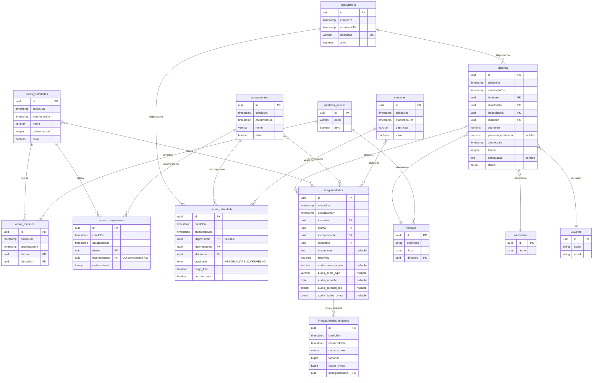

# MER – Tabelas de Vistoria

Diagrama de entidade-relacionamento do módulo de vistoria (backend).

## Diagrama (Mermaid)

## Resumo das entidades

| Tabela | Descrição |
|--------|-----------|
| **tiposvistoria** | Cadastro de tipos de vistoria (ex.: Preventiva, Corretiva). |
| **vistorias** | Cabeçalho da vistoria: veículo, motorista, tipo, usuário, odômetro, data, status. |
| **areas_vistoriadas** | Áreas de inspeção (ex.: Dianteiro, Traseiro). |
| **areas_modelos** | Quais modelos de veículo cada área atende (área ↔ modelo). |
| **areas_componentes** | Quais componentes são vistoriados em cada área (1 componente → 1 área). |
| **componentes** | Catálogo de componentes (ex.: Pneu, Farol). |
| **sintomas** | Catálogo de sintomas/defeitos (ex.: Desgaste, Quebrado). |
| **matriz_criticidade** | Regras por (tipo vistoria + componente + sintoma): gravidade, exige foto, permite áudio. |
| **irregularidades** | Registro de irregularidade na vistoria: área, componente, sintoma, observação, áudio. |
| **irregularidades_imagens** | Fotos anexadas à irregularidade. |

## Regras de negócio refletidas no MER

- **Componente fixo à área:** em `areas_componentes` há UNIQUE em `idcomponente` (cada componente em no máximo uma área).
- **Matriz por tipo de vistoria:** `matriz_criticidade` tem `idtipovistoria`; a regra é por (tipo + componente + sintoma).
- **Áreas por modelo:** `areas_modelos` define quais áreas aparecem para cada modelo de veículo na vistoria mobile.
