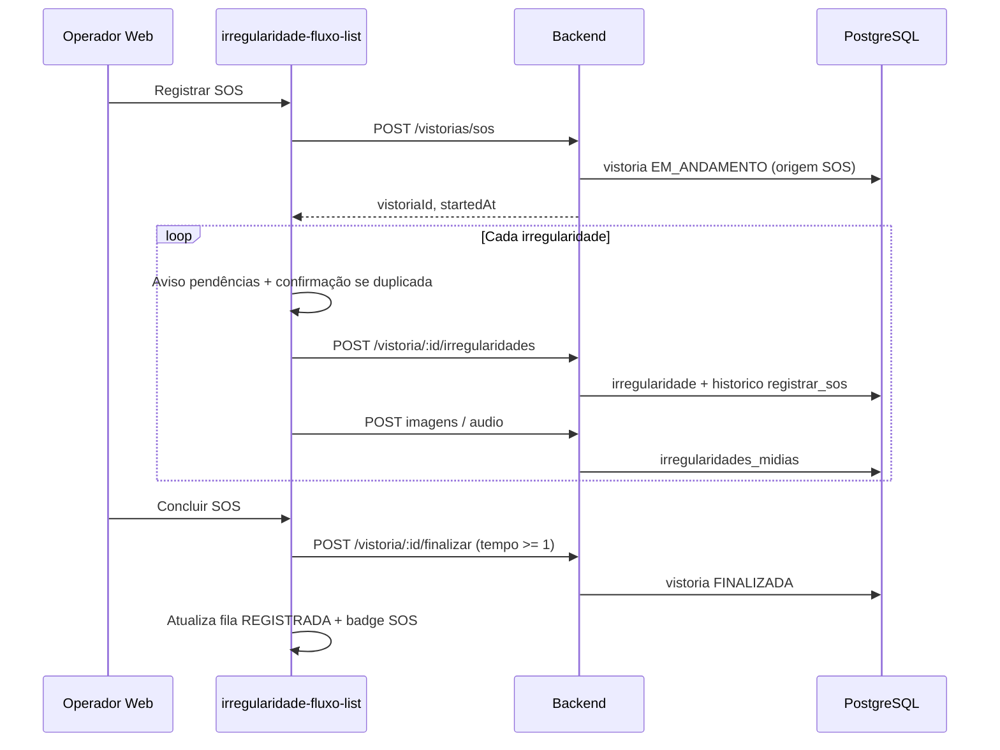

# Plano: Irregularidade SOS (Web)

**Data:** 08/06/2026  
**Status:** Implementado  
**Objetivo:** Permitir registro de irregularidades SOS diretamente na tela web de **Tratamento de Irregularidades**, com vistoria pai automática, múltiplas irregularidades por sessão, destaque e filtro SOS em todo o fluxo, sem alterar o comportamento do mobile.

**Escopo:** Backend (NestJS), Frontend Web (Angular), migration, permissões, documentação de regra de negócio.  
**Fora de escopo:** Alterações no app mobile; gravação de áudio no browser (v1 usa upload de arquivo).

---

## Índice

1. [Contexto](#contexto)
2. [Decisões de produto](#decisões-de-produto)
3. [Regras de negócio (RN-VIS-004)](#regras-de-negócio-rn-vis-004)
4. [Modelo de dados](#modelo-de-dados)
5. [Permissões](#permissões)
6. [API e contratos](#api-e-contratos)
7. [Fluxo técnico](#fluxo-técnico)
8. [Modal SOS — usabilidade](#modal-sos--usabilidade)
9. [Mídias](#mídias)
10. [Listagem, badge e filtro SOS](#listagem-badge-e-filtro-sos)
11. [Vistorias (web)](#vistorias-web)
12. [Riscos e mitigações](#riscos-e-mitigações)
13. [Critérios de aceite](#critérios-de-aceite)
14. [Tarefas técnicas](#tarefas-técnicas)
15. [Validação e testes](#validação-e-testes)
16. [Histórico de alterações](#histórico-de-alterações)

---

## Contexto

Hoje irregularidades são registradas **apenas pelo mobile**, dentro de uma vistoria `EM_ANDAMENTO`. Após finalizar a vistoria, as irregularidades entram na fila web de Tratamento (`REGISTRADA`).

A operação web precisa registrar irregularidades **urgentes (SOS)** sem depender do aplicativo, mantendo:

- Vínculo obrigatório com vistoria pai (`irregularidades.idvistoria`);
- Mesma tabela de mídias (`irregularidades_midias`);
- Mesmo fluxo pós-registro (tratamento → manutenção → validação);
- Compatibilidade com RN-VIS-002 (descrição obrigatória) e RN-VIS-003 (permissões por etapa).

A fila web (`GET /irregularidades`) só lista irregularidades cuja vistoria está `FINALIZADA`. Portanto a vistoria SOS deve ser finalizada ao concluir a sessão (ou cancelada em cascata se o usuário desistir).

---

## Decisões de produto

| Tema | Decisão |
|------|---------|
| Permissão | Nova `irregularidade_tratamento:create_sos`; sem permissão = sem botão |
| Fila | `REGISTRADA` para todos com `:read`; badge **SOS** em Tratamento, Manutenção e Validação |
| Filtro | Opção para exibir somente irregularidades SOS (nas 3 telas do fluxo) |
| Origem | Campo opcional na irregularidade: `null` (mobile), `SOS_WEB` (web) |
| Vistoria pai | Criada automaticamente; veículo e motorista por autocomplete; odômetro/bateria informados pelo usuário |
| Data da vistoria | Data/hora atual do **servidor** |
| Vistoriador | Usuário logado na web |
| Observação vistoria | Opcional (pode ser vazia) |
| Observação irregularidade | Obrigatória (RN-VIS-002) |
| Múltiplas irregularidades | Sim, na mesma vistoria SOS antes de concluir |
| Vistoria aberta | Permanece `EM_ANDAMENTO` até **Concluir SOS** ou **Cancelar SOS** |
| Cancelar SOS | Vistoria `CANCELADA` em **cascata** (remove irregularidades e mídias) |
| Coexistência mobile | Permitido SOS com vistoria mobile `EM_ANDAMENTO` no mesmo veículo |
| Pendente duplicada | Avisar, listar O.S., confirmação explícita; **não bloquear** |
| Pós-registro | Igual ao mobile (reclassificar, cancelar, manutenção, validação) |
| Tempo da vistoria | Contabilizado como no mobile (`max(1, minutos desde início)`) |
| Odômetro | Pré-preencher último; validar no frontend e backend (regra mobile) |
| Catálogo | Áreas, componentes e sintomas **somente do modelo do veículo** selecionado |
| Vistorias (web) | Vistoria SOS aparece na listagem com indicação de origem |
| Tema UI | Claro e escuro |

---

## Regras de negócio (RN-VIS-004)

> Após implementação, registrar em `docs/regras-negocio.md` com status **Aprovada**.

### RN-VIS-004 — Registrar irregularidade SOS na web (Tratamento)

- **Módulo:** Vistoria
- **Fluxo:** Tela web Tratamento (`/irregularidades/tratamento`)
- **Descrição:** Operador com permissão dedicada pode abrir sessão SOS, registrar uma ou mais irregularidades com vistoria pai automática e concluir ou cancelar a sessão. Irregularidades SOS seguem o fluxo normal após o registro.
- **Condições de entrada:** Usuário autenticado com `irregularidade_tratamento:create_sos` e `irregularidade_tratamento:read`
- **Validações:**
  - Veículo e motorista ativos, selecionados via autocomplete
  - Odômetro > 0, ≤ 9.999.999; se existir último odômetro do veículo, deve ser maior (backend e frontend)
  - Diferença > 200 km em relação ao último odômetro exige confirmação explícita no frontend
  - Bateria obrigatória (0–100) para veículo elétrico
  - Irregularidade: área, componente e sintoma válidos para o modelo do veículo; matriz deve existir
  - `observacao` da irregularidade obrigatória após `trim` (RN-VIS-002)
  - `observacao` da vistoria opcional
  - Matriz: respeitar `exigeFoto` e `permiteAudio`
  - Concluir SOS exige ao menos 1 irregularidade salva e nenhuma pendência de foto obrigatória
  - Se existir irregularidade pendente (mesmo veículo + componente + sintoma), exibir aviso e exigir confirmação; não bloquear
- **Ações do sistema:**
  - Criar vistoria `EM_ANDAMENTO` com origem SOS
  - Registrar irregularidade(s) com `origem_registro = SOS_WEB` e `status_atual = REGISTRADA`
  - Gravar histórico com ação `registrar_sos` e observação *"Irregularidade registrada por SOS"*
  - Anexar mídias em `irregularidades_midias`
  - Ao concluir: finalizar vistoria com tempo em minutos (mínimo 1)
  - Ao cancelar: vistoria `CANCELADA` e remoção em cascata de irregularidades e mídias
- **Mensagens ao usuário:**
  - Sem permissão: botão oculto; API 403
  - Cancelar SOS: confirmação de irreversibilidade
  - Pendente duplicada: *"Já existe O.S. #XXXX — registrar mesmo assim?"*
- **Permissões envolvidas:**
  - `irregularidade_tratamento:create_sos` (registrar, mídias, finalizar/cancelar SOS)
  - `irregularidade_tratamento:read` (ver fila após registro)
  - Demais ações do fluxo: permissões já existentes (RN-VIS-003)
- **Dados impactados:**
  - `irregularidades.origem_registro`
  - `vistorias.origem` (opcional, para listagem web)
  - `vistorias`, `irregularidades`, `irregularidades_midias`, `irregularidade_historico`
- **Rastreabilidade:** Histórico de irregularidade com usuário, data e tempo de etapa (mesmo padrão do mobile)
- **Critérios de aceite:** ver [seção dedicada](#critérios-de-aceite)
- **Cenários de exceção:**
  - Falha de upload de mídia após criar irregularidade: permitir retry enquanto vistoria SOS aberta
  - Vistoria mobile em andamento no mesmo veículo: aviso informativo, sem bloqueio
- **Origem da regra:** Requisito de produto — irregularidade SOS web, 2026-06-08
- **Status:** Planejada

---

## Modelo de dados

### Migration: `irregularidades.origem_registro`

| Coluna | Tipo | Nullable | Default | Valores |
|--------|------|----------|---------|---------|
| `origem_registro` | `varchar(20)` | Sim | `NULL` | `NULL` (mobile implícito), `SOS_WEB` |

- Registros existentes: `NULL` (= mobile).
- Índice opcional: `(origem_registro, status_atual)` se filtro SOS for frequente.

### Migration opcional: `vistorias.origem`

| Coluna | Tipo | Nullable | Default | Valores |
|--------|------|----------|---------|---------|
| `origem` | `varchar(20)` | Sim | `NULL` | `NULL` (mobile), `SOS_WEB` |

Facilita listagem e relatório na tela **Vistorias (web)**.

### Enum sugerido (backend)

```typescript
export enum OrigemRegistroIrregularidade {
  SOS_WEB = 'SOS_WEB',
}
// mobile: origem_registro = null
```

---

## Permissões

### Nova permissão

| Key | Label (cadastro de perfil) | Grupo |
|-----|---------------------------|-------|
| `irregularidade_tratamento:create_sos` | Registrar irregularidade SOS (web) | Irregularidades – Tratamento |

### Arquivos

- `backend/src/common/enums/permission.enum.ts` — enum + `PERMISSION_GROUPS`
- `frontend` — enum espelhado + tela de perfis

### Guards estendidos

Durante a sessão SOS, endpoints abaixo devem aceitar `create_sos` **quando a vistoria vinculada for SOS** (além de `vistoria_mobile:update`):

| Endpoint | Uso na sessão SOS |
|----------|-------------------|
| `POST /vistorias/sos` | Criar vistoria pai |
| `POST /vistoria/:id/irregularidades` | Registrar irregularidade |
| `POST /irregularidades/:id/imagens` | Upload imagens |
| `POST /irregularidades/:id/audio` | Upload áudio |
| `DELETE /irregularidades/:id/audio` | Remover áudios |
| `DELETE /irregularidades/:id/midias/:midiaId` | Remover mídia |
| `POST /vistoria/:id/finalizar` | Concluir SOS |
| `POST /vistoria/:id/cancelar` (ou equivalente) | Cancelar SOS |

Após conclusão, o fluxo usa apenas permissões RN-VIS-003 (`tratamento:update`, `manutencao:*`, etc.).

---

## API e contratos

### `POST /vistorias/sos`

Cria vistoria pai `EM_ANDAMENTO`.

**Permissão:** `irregularidade_tratamento:create_sos`

**Body (DTO):**

```typescript
{
  idveiculo: string;      // uuid
  idmotorista: string;    // uuid
  odometro: number;       // min 0.01, max 9999999
  porcentagembateria?: number; // obrigatório se elétrico
  observacao?: string;    // opcional
}
```

**Comportamento servidor:**

- `idusuario` = usuário autenticado
- `datavistoria` = `now()` servidor
- `origem` = `SOS_WEB` (se coluna existir)
- `status` = `EM_ANDAMENTO`
- Validar odômetro (regra mobile) no service

**Response:** `201` — objeto `Vistoria`

---

### Irregularidade na sessão SOS

Reutilizar `POST /vistoria/:id/irregularidades` com `CreateIrregularidadeDto` existente.

**Adicional no service:**

- Setar `origem_registro = SOS_WEB`
- Histórico: `acao = registrar_sos`, `observacao = "Irregularidade registrada por SOS"`
- Validar que vistoria pertence à sessão SOS e está `EM_ANDAMENTO`

---

### Mídias

Reutilizar endpoints existentes:

- `POST /irregularidades/:id/imagens` — até 10 arquivos, 5 MB cada (após compressão)
- `POST /irregularidades/:id/audio` — 15 MB máximo por arquivo

Permissão estendida: `create_sos` em vistoria SOS aberta.

---

### `POST /vistoria/:id/finalizar` (Concluir SOS)

**Body:** `FinalizeVistoriaDto` — `tempo` ≥ 1 (minutos), `observacao` opcional.

Frontend envia `tempo = max(1, round((now - startedAt) / 60000))`, igual ao mobile.

---

### Cancelar SOS

**Endpoint:** `POST /vistoria/:id/cancelar` (existente ou dedicado SOS)

- Apenas vistoria SOS `EM_ANDAMENTO`
- `status` → `CANCELADA`
- Cascata: irregularidades e `irregularidades_midias`

---

### Listagem com filtro SOS

**`GET /irregularidades`**

Novo query param opcional:

| Param | Valores | Descrição |
|-------|---------|-----------|
| `origemRegistro` | `SOS_WEB` | Filtra irregularidades SOS |

Incluir `origemRegistro` no DTO de resposta (`IrregularidadeResumoDto` / `IrregularidadeFluxoItem`).

---

### Irregularidades pendentes

Reutilizar `GET /vistoria/veiculo/:id/irregularidades-pendentes` no modal SOS (já existente).

---

## Fluxo técnico



**Ordem obrigatória por irregularidade:** criar registro → upload mídias → só então habilitar Concluir SOS (validar `exigeFoto`).

**Cancelar em qualquer etapa:** `CANCELADA` + cascata.

---

## Modal SOS — usabilidade

Modal na tela **Tratamento** (`irregularidade-fluxo-list`), padrão visual dos modais existentes, tema claro/escuro.

### Abertura

- Botão **"Registrar SOS"** na `actions-panel` (visível só com `create_sos`).
- Ícone + texto **SOS** (acessível; não depender só de cor).

### Indicador de etapas

`1. Dados da vistoria` → `2. Irregularidades` → `3. Revisão`

---

### Etapa 1 — Dados da vistoria SOS

| Campo | UX |
|-------|-----|
| Veículo | `app-veiculo-autocomplete` |
| Motorista | `app-motorista-autocomplete` (após veículo) |
| Odômetro | Pré-preenchido via `GET /vistoria/veiculo/:id/ultimo-odometro`; editável |
| % Bateria | Visível/obrigatório se `combustivel === eletrico` |
| Observação vistoria | Textarea opcional |

**Banners:**

- Vistoria mobile `EM_ANDAMENTO` no veículo: informativo, sem bloqueio.

**Botões:** `Cancelar` | `Avançar`  
**Avançar:** valida campos → `POST /vistorias/sos` → guarda `vistoriaId` e `startedAt`.

---

### Etapa 2 — Irregularidades (loop)

**Classificação (cascata filtrada pelo modelo do veículo):**

1. Área (autocomplete)
2. Componente (autocomplete, área selecionada)
3. Sintoma (lista da matriz do componente)
4. Chips: gravidade, exige foto, permite áudio

**Painel lateral — Pendências do veículo:**

- Lista de `irregularidades-pendentes`
- Cada item: **O.S. #XXXX**, área, componente, sintoma, data
- Destaque quando coincide com seleção atual

**Descrição do problema** — obrigatória.

**Mídias:**

- Fotos: file picker múltiplo, preview, remover
- Áudios (se `permiteAudio`): upload de arquivo, preview player, remover
- v1: **sem gravação no browser**

**Lista "Irregularidades salvas nesta sessão":**

- Cards: `#O.S.`, classificação, qtd fotos/áudios
- Remover (com confirmação) enquanto vistoria aberta

**Ao salvar (Salvar / Adicionar outra):**

1. Validar formulário e matriz
2. Se pendente duplicada → modal:
   > Já existe irregularidade pendente para este veículo, componente e sintoma.  
   > O.S. #XXXX — registrada em DD/MM/AAAA.  
   > Deseja registrar mesmo assim?
3. `POST irregularidade` + uploads
4. Em falha de mídia: mensagem + **Tentar novamente** (sem recriar irregularidade)

**Botões:**

| Botão | Ação |
|-------|------|
| Voltar | Etapa 1 (com aviso se já houver irregularidades salvas) |
| Salvar irregularidade | Salva e permanece no formulário limpo ou na lista |
| Adicionar outra | Salva e limpa formulário para nova irregularidade |
| Cancelar vistoria SOS | Confirmação + cascata |

---

### Etapa 3 — Revisão e conclusão

**Resumo somente leitura:**

- Veículo, motorista, odômetro, bateria
- Tempo decorrido (ex.: "4 min")
- Tabela de irregularidades salvas (badge SOS)
- Observação da vistoria

**Validações:**

- ≥ 1 irregularidade salva
- Nenhuma violação de `exigeFoto` pendente

**Botões:** `Voltar` | `Cancelar vistoria SOS` | `Concluir SOS`

**Concluir SOS:** `POST finalizar` com tempo calculado → toast sucesso → refresh fila → fecha modal.

**Cancelar (qualquer etapa, inclusive X do modal):**

> Cancelar remove a vistoria SOS e todas as irregularidades registradas nesta sessão.  
> Esta ação não pode ser desfeita.

---

## Mídias

### Estrutura

Mesma tabela e formato do mobile: `irregularidades_midias` (`tipo`: `imagem` | `audio`).

### Imagens

**Referência mobile:** câmera com `quality: 60`, máximo 1024×1024, JPEG.

**Web (antes do upload):**

- Redimensionar maior lado para 1024 px
- Exportar JPEG com qualidade ~60% (canvas ou biblioteca leve)

**Backend (recomendado na v1):**

- Implementar compressão em `otimizarImagemParaArmazenamento` (hoje pass-through) para benefício mobile + web

**Limites API:** 10 imagens × 5 MB; nomenclatura via `buildMidiaFilename`.

### Áudios

- Upload de arquivo; máximo **15 MB** por arquivo (limite atual do controller)
- Respeitar `permiteAudio` da matriz
- Múltiplos áudios permitidos por irregularidade
- MIME: validar tipos aceitos (ex.: `audio/mpeg`, `audio/mp4`, `audio/webm`, `audio/wav`)

### Retry

Falha de upload após criar irregularidade: botão **Tentar novamente** na Etapa 2, com vistoria ainda `EM_ANDAMENTO`.

---

## Listagem, badge e filtro SOS

### Telas impactadas

- `/irregularidades/tratamento`
- `/irregularidades/manutencao`
- `/irregularidades/validacao-final`

### Badge SOS

- Texto **"SOS"** + ícone em cada card/linha quando `origemRegistro === SOS_WEB`
- Contraste adequado em tema claro e escuro (não usar só cor)

### Filtro

- Novo controle na `filters-panel`: `Origem: Todas | SOS | Mobile` (ou checkbox "Somente SOS")
- Query `origemRegistro=SOS_WEB` na API

### Ordenação da fila

- Irregularidades SOS (`origem_registro = SOS_WEB`) **sempre no topo** em Tratamento, Manutenção e Validação Final
- Dentro do grupo SOS e do grupo demais: **mais antiga primeiro**, pela mesma data da coluna "Registrado" (`criadoEm` em Tratamento; `entradaStatusEm` nas demais etapas)
- Implementado em `GET /irregularidades` (`listByStatus`) e espelhado no front (`sortItemsFluxo`)

### Histórico

- Ação `registrar_sos` → label *"Registrar irregularidade SOS"*
- Observação: *"Irregularidade registrada por SOS"*
- Usuário, data e `tempoEtapaMs` — mesmo padrão do mobile

---

## Vistorias (web)

- Tela `vistoria-list`: exibir vistorias SOS (`vistorias.origem = SOS_WEB` ou derivado das irregularidades)
- Coluna ou badge de origem
- Filtro opcional por origem (fase 1 ou 1.1)
- Vistorias SOS `EM_ANDAMENTO` visíveis até concluir ou cancelar

---

## Riscos e mitigações

| Risco | Impacto | Mitigação (aprovada) |
|-------|---------|----------------------|
| Vistoria SOS abandonada `EM_ANDAMENTO` | Irregularidades não entram na fila | Wizard com Concluir/Cancelar; confirmação ao fechar modal |
| Cancelar sessão | Dados órfãos | Cancelar vistoria em **cascata** |
| Falha parcial (irregularidade OK, mídia falha) | Registro incompleto | Retry de mídia; validar `exigeFoto` antes de Concluir |
| Finalizar antes das mídias | Upload bloqueado | Vistoria aberta até Concluir/Cancelar; desabilitar Concluir se faltar foto |
| Sem campo `origem_registro` | Filtro/badge inconsistente | Migration obrigatória |
| Permissão só no botão | 403 no meio do fluxo | Estender guards nos endpoints da sessão SOS |
| Odômetro só no cliente | Dados incoerentes | Validar no backend no endpoint SOS |
| Duplicidade operacional | Duas O.S. iguais | Aviso + lista pendências + confirmação explícita |
| Imagens grandes no web | Lentidão / estouro limite | Compressão client + backend |
| Tempo vistoria = 0 | Erro 400 no finalizar | `tempo >= 1`, cálculo desde `startedAt` |

---

## Critérios de aceite

1. [ ] Usuário **sem** `irregularidade_tratamento:create_sos` não vê o botão "Registrar SOS".
2. [ ] Tentativa direta na API sem permissão retorna **403**.
3. [ ] Usuário com permissão conclui SOS; irregularidades aparecem na fila **REGISTRADA** para todos com `:read`.
4. [ ] Badge **SOS** visível em Tratamento, Manutenção e Validação.
5. [ ] Filtro "Somente SOS" funciona nas três telas.
5b. [ ] Irregularidades SOS aparecem **antes** das demais na listagem das três telas; dentro de cada grupo, mais antiga primeiro.
6. [ ] Histórico exibe usuário, data, tempo de etapa; observação *"Irregularidade registrada por SOS"*.
7. [ ] Vistoria pai criada com veículo/motorista (autocomplete), odômetro e bateria (se elétrico); vistoriador = usuário logado; data = servidor.
8. [ ] Observação da vistoria opcional; observação da irregularidade obrigatória (RN-VIS-002).
9. [ ] Múltiplas irregularidades na mesma sessão SOS antes de concluir.
10. [ ] Mídias em `irregularidades_midias`; `exigeFoto` e `permiteAudio` respeitados.
11. [ ] Imagens comprimidas no web (1024px, JPEG ~60%) antes do upload.
12. [ ] Áudio com limite máximo de 15 MB por arquivo.
13. [ ] Pendências listadas no modal; confirmação ao registrar duplicata; sem bloqueio.
14. [ ] Cancelar SOS remove vistoria e irregularidades (cascata).
15. [ ] Vistoria SOS visível na tela Vistorias (web).
16. [ ] UI funcional em tema claro e escuro.
17. [ ] Após registro, reclassificar/cancelar/enviar manutenção funcionam como irregularidade mobile.
18. [ ] Tempo da vistoria SOS registrado com mesma lógica do mobile (mínimo 1 minuto).

---

## Tarefas técnicas

### Backend

- [x] Migration `irregularidades.origem_registro` (+ opcional `vistorias.origem`)
- [x] Enum `OrigemRegistroIrregularidade` / `OrigemVistoria`
- [x] Permissão `irregularidade_tratamento:create_sos` em `permission.enum.ts`
- [x] DTO `CreateVistoriaSosDto` com validações
- [x] `VistoriaService.createSos()` + validação odômetro
- [x] `VistoriaController` — `POST /vistorias/sos`
- [x] `IrregularidadeService` — setar origem, histórico `registrar_sos`
- [x] Guards: `create_sos` nos endpoints da sessão SOS
- [x] `listByStatus` — filtro `origemRegistro` + campo no DTO
- [ ] `otimizarImagemParaArmazenamento` — compressão JPEG (recomendado; v1 usa compressão no frontend)
- [x] RN-VIS-004 em `docs/regras-negocio.md`

### Frontend Web

- [x] Permissão no enum + perfis
- [x] Botão "Registrar SOS" em `irregularidade-fluxo-list`
- [x] Modal wizard 3 etapas (HTML/CSS/TS)
- [x] Integração autocompletes veículo/motorista
- [x] Cascata área/componente/sintoma por modelo
- [x] Painel pendências + confirmação duplicata
- [x] Compressão de imagem antes do upload
- [x] Upload mídias + retry
- [x] Badge SOS + filtro origem nas 3 telas do fluxo
- [x] Label histórico `registrar_sos`
- [x] `vistoria-list` — exibir origem SOS
- [x] Services: `criarVistoriaSos`, orquestração da sessão

### Fora do escopo v1

- Gravação de áudio no browser (`MediaRecorder`)
- Job de limpeza de vistorias SOS abandonadas
- BI separado SOS vs mobile

---

## Validação e testes

### Manual

1. Perfil sem `create_sos`: botão ausente.
2. Perfil com `create_sos` + `tratamento:read`: fluxo completo 1 irregularidade + mídias.
3. Sessão com 2 irregularidades; concluir; ambas na fila com badge SOS.
4. Cancelar sessão com 1 irregularidade salva; nada na fila.
5. Pendente duplicada: aviso + confirmação + registro permitido.
6. `exigeFoto` sem foto: bloqueio ao concluir.
7. Veículo elétrico sem bateria: erro na Etapa 1.
8. Odômetro ≤ último: erro backend e frontend.
9. Tema escuro: modal, badge, filtros, erros.
10. Vistoria SOS na listagem web.

### Backend (sugerido)

- `createSos` valida odômetro
- `registrar_sos` no histórico
- Filtro `origemRegistro=SOS_WEB`
- Guard `create_sos` em vistoria SOS
- Cancelamento cascata

---

## Histórico de alterações

| Data | Alteração |
|------|-----------|
| 2026-06-08 | Criação do plano com decisões de produto, UX do modal, API, riscos e critérios de aceite alinhados em sessão de especificação. |
| 2026-06-08 | Implementação completa (backend + frontend web); migration `AddOrigemSosIrregularidadesVistorias1744200000000` aplicada; build backend e frontend OK. |

---

## Referências

- `docs/regras-negocio.md` — RN-VIS-002, RN-VIS-003; RN-VIS-004 a incluir
- `docs/BACKLOG_FLUXO_IRREGULARIDADES.md` — matriz de estados do fluxo
- `docs/PLANO_MELHORIAS_VISTORIA_IRREGULARIDADES.md` — pendentes e mídias
- `frontend/src/app/components/irregularidade-fluxo-list/` — tela Tratamento
- `backend/src/modules/vistoria/irregularidade.service.ts` — criação, mídias, listagem
- `mobile/src/app/pages/vistoria/vistoria-inicio.page.ts` — validação odômetro
- `mobile/src/app/pages/vistoria/vistoria-irregularidade.page.ts` — fotos (quality 60, 1024px)
